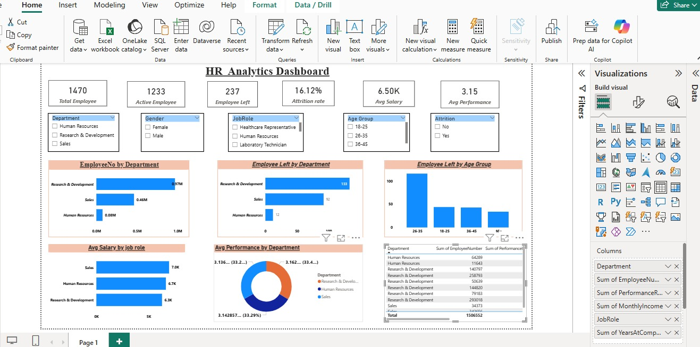

# HR Analytics & Employee Performance Dashboard

An interactive HR Analytics and Employee Performance Dashboard built using Power BI, Power Query, and DAX.

## 📊 Project Overview

This project analyzes employee data to provide insights into workforce distribution, employee performance, attrition, salary, and employee demographics.

The dashboard is designed as a single-page HR Analytics solution that helps HR teams understand workforce trends and make data-driven decisions.

## 🖼️ Dashboard Preview

## 🎯 Project Objectives

- Analyze total and active employees
- Identify employee attrition and attrition rate
- Analyze employee performance across departments
- Compare average salary by job role
- Analyze employee distribution by department
- Understand attrition across different age groups
- Provide an interactive HR dashboard for decision-making

## 🛠️ Tools & Technologies

- **Power BI** – Dashboard development and data visualization
- **Power Query** – Data cleaning and transformation
- **DAX** – Measures and calculated columns
- **Microsoft Excel** – Dataset source

## 🧹 Data Cleaning & Transformation

The dataset was prepared using Power Query before building the dashboard.

Key steps included:

- Removed duplicate records
- Checked and corrected data types
- Handled missing and inconsistent values
- Cleaned categorical fields
- Created meaningful age groups
- Prepared data for analysis and visualization

## 📐 DAX Measures

Some of the key measures used in the dashboard include:

- Total Employees
- Active Employees
- Employees Left
- Attrition Rate
- Average Salary
- Average Performance

## 📈 Dashboard Features

The dashboard includes:

- KPI cards for HR overview
- Department slicer
- Gender slicer
- Job Role slicer
- Age Group slicer
- Employee count by department
- Employee attrition by department
- Average salary by job role
- Employee performance by department
- Attrition by age group
- Employee performance details table

## 💡 Key Insights

The dashboard helps identify:

- Workforce distribution across departments
- Departments with higher employee attrition
- Performance differences between departments
- Salary differences across job roles
- Age groups with higher employee turnover
- Overall employee performance trends

## 📁 Project Files

| File | Description |
|---|---|
| `HR_Analytics_Dashboard.pbix` | Power BI dashboard and complete data model |
| `HR_Analytics_Dataset.xlsx` | Source HR dataset |
| `HR_Analytics_Dashboard.jpeg` | Dashboard preview image |

## 👤 Author

**Sattisanullah55**

Data Analytics Project using Power BI, Power Query, DAX, and Excel.
